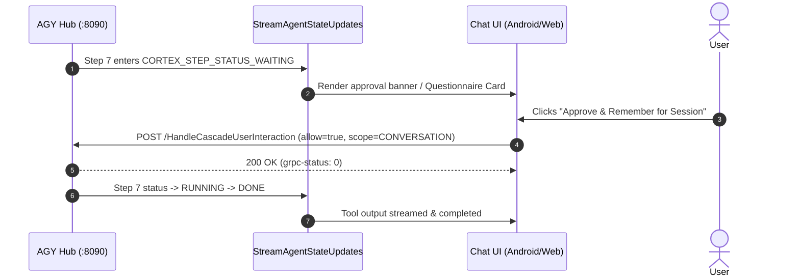

# `HandleCascadeUserInteraction` (User Tool Approval & Interaction Resolution RPC)

## 1. Overview & Purpose
`HandleCascadeUserInteraction` resolves a paused/pending tool execution step that requires user input, confirmation, or permissions before proceeding.

It is invoked when a step enters `CORTEX_STEP_STATUS_WAITING` for:
1. **Tool Execution Approval**: Allowing or denying shell command execution, file modifications, or subagent invocations.
2. **Permission Scoping**: Granting permissions once, for the conversation, or persisting across the project (`PERMISSION_SCOPE_ONCE`, `PERMISSION_SCOPE_CONVERSATION`, `PERMISSION_SCOPE_PROJECT`).
3. **Interactive Questionnaire Submissions**: Answering MCP questionnaires (`ask_question` / `ask_choices`) with single/multi-choice selections or freeform responses.

---

## 2. Wire Protocol & Endpoint Specification

- **Service Path:** `/exa.language_server_pb.LanguageServerService/HandleCascadeUserInteraction`
- **HTTP Method:** `POST`
- **Wire Format:** gRPC-Web framed JSON or Connect-RPC JSON
- **Default Port:** `8090` (or `8091` via proxy)

### HTTP Headers
```http
POST /exa.language_server_pb.LanguageServerService/HandleCascadeUserInteraction HTTP/1.1
Host: 127.0.0.1:8090
Content-Type: application/grpc-web+json
Accept: */*
x-grpc-web: 1
Connect-Protocol-Version: 1
x-codeium-csrf-token: <CSRF_TOKEN>
```

---

## 3. Concrete Request Schemas

### Type A: Tool Permission Grant / Approval
```json
{
  "cascadeId": "f114692e-a724-47fd-b3bf-969760907bbf",
  "interaction": {
    "trajectoryId": "54f2c6dd-b8d0-4ba0-acba-1fe3c49c0c66",
    "stepIndex": 7,
    "permission": {
      "allow": true,
      "scope": "PERMISSION_SCOPE_CONVERSATION",
      "persistGrants": {
        "allow": [
          "mcp(dummy-mcp/dummy_greeting)"
        ]
      }
    }
  }
}
```

### Type B: Choice Questionnaire Resolution (`ask_question` / `ask_choices`)
```json
{
  "cascadeId": "f114692e-a724-47fd-b3bf-969760907bbf",
  "interaction": {
    "trajectoryId": "54f2c6dd-b8d0-4ba0-acba-1fe3c49c0c66",
    "stepIndex": 12,
    "mcp": {
      "selectedChoices": [
        "Use Kotlin Serialization"
      ],
      "freeformText": ""
    }
  }
}
```

---

## 4. Kotlin `@Serializable` Request & Response Models

```kotlin
package com.example.gemini.data.remote.dto

import kotlinx.serialization.Serializable

@Serializable
data class HandleCascadeUserInteractionRequestDto(
    val cascadeId: String = "",
    val interaction: CascadeInteractionDto = CascadeInteractionDto()
)

@Serializable
data class CascadeInteractionDto(
    val trajectoryId: String = "",
    val stepIndex: Int = 0,
    val permission: PermissionInteractionResolutionDto? = null,
    val mcp: McpInteractionResolutionDto? = null
)

@Serializable
data class PermissionInteractionResolutionDto(
    val allow: Boolean = true,
    val scope: String = "PERMISSION_SCOPE_ONCE",
    val persistGrants: PersistGrantsDto? = null
)

@Serializable
data class PersistGrantsDto(
    val allow: List<String> = emptyList(),
    val deny: List<String> = emptyList()
)

@Serializable
data class McpInteractionResolutionDto(
    val selectedChoices: List<String> = emptyList(),
    val freeformText: String = ""
)

@Serializable
data class HandleCascadeUserInteractionResponseDto(
    val success: Boolean = true
)
```

---

## 5. Permission Scope Enums (`permission.scope`)

| Scope Enum | Meaning | Persistence |
| :--- | :--- | :--- |
| `PERMISSION_SCOPE_ONCE` | Allow only this single step execution. | None |
| `PERMISSION_SCOPE_CONVERSATION` | Allow this tool/domain for the remainder of this chat session. | Memory / active trajectory |
| `PERMISSION_SCOPE_PROJECT` | Remember permission for this workspace project permanently. | Written to project settings |
| `PERMISSION_SCOPE_PERMANENT` | Global permission across all workspaces and conversations. | Global configuration |

---

## 6. Concrete Response & Trailer

### Response Frame #1 (DATA)
```json
{}
```

### Response Frame #2 (TRAILER)
```http
grpc-status: 0
```

---

## 7. Client Flow & State Transition



---

## 8. Real Traffic Examples (from `4ngvbt8.json`, `9i5dq01.json`, `xcc36m1.json`)

### Example 1: Single Permission Grant
```json
{
  "cascadeId": "f114692e-a724-47fd-b3bf-969760907bbf",
  "interaction": {
    "trajectoryId": "54f2c6dd-b8d0-4ba0-acba-1fe3c49c0c66",
    "stepIndex": 7,
    "permission": {
      "allow": true,
      "scope": "PERMISSION_SCOPE_ONCE"
    }
  }
}
```

### Example 2: Project-Scoped Web URL Grant
```json
{
  "cascadeId": "f114692e-a724-47fd-b3bf-969760907bbf",
  "interaction": {
    "trajectoryId": "54f2c6dd-b8d0-4ba0-acba-1fe3c49c0c66",
    "stepIndex": 17,
    "permission": {
      "allow": true,
      "scope": "PERMISSION_SCOPE_PROJECT",
      "persistGrants": {
        "allow": ["read_url(example.com)"]
      }
    }
  }
}
```
