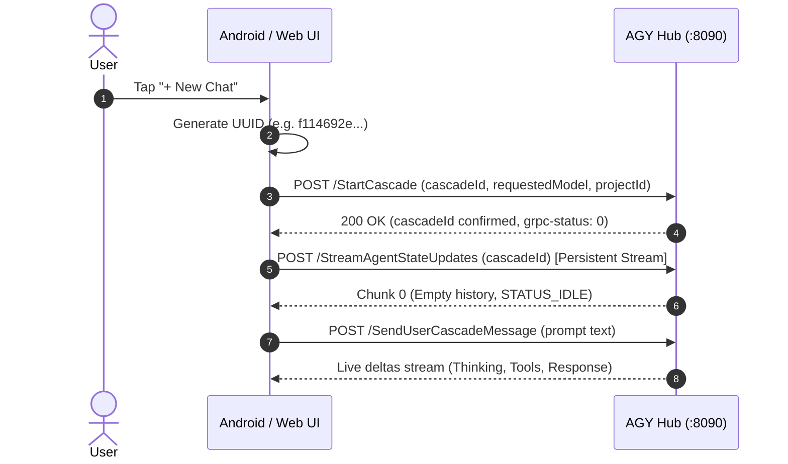

# `StartCascade` (Conversation Session Initialization RPC)

## 1. Overview & Purpose
`StartCascade` initializes a brand-new conversation session (cascade trajectory) in the AGY Hub daemon. It binds:
- A unique conversation UUID (`cascadeId`).
- An active project or workspace environment (`projectId`, workspace directories).
- The initial default AI model (`requestedModel`).
- Agent specialization configuration (`customAgentSpec`).

Once initialized, the client can immediately connect to `StreamAgentStateUpdates` to observe live events and send user prompts via `SendUserCascadeMessage`.

---

## 2. Wire Protocol & Endpoint Specification

- **Service Path:** `/exa.language_server_pb.LanguageServerService/StartCascade`
- **HTTP Method:** `POST`
- **Wire Format:** gRPC-Web framed JSON or standard Connect-RPC JSON
- **Default Port:** `8090` (or `8091` via proxy)

### HTTP Headers
```http
POST /exa.language_server_pb.LanguageServerService/StartCascade HTTP/1.1
Host: 127.0.0.1:8090
Content-Type: application/grpc-web+json
Accept: */*
x-grpc-web: 1
Connect-Protocol-Version: 1
x-codeium-csrf-token: <CSRF_TOKEN>
```

---

## 3. Concrete Request Schema

### Request Body (JSON)
```json
{
  "source": "CORTEX_TRAJECTORY_SOURCE_CASCADE_CLIENT",
  "cascadeId": "f114692e-a724-47fd-b3bf-969760907bbf",
  "requestedModel": "MODEL_PLACEHOLDER_M299",
  "workspaceUris": [
    "file:///home/cat/project"
  ],
  "projectEnvConfig": {
    "projectId": "default-cli-project",
    "defaultProjectEnvironment": {}
  },
  "customAgentSpec": {
    "builtinAgent": {
      "defaultAgent": {
        "isGoogle": false,
        "isInteractive": true
      }
    }
  }
}
```

---

## 4. Kotlin `@Serializable` Request & Response Models

```kotlin
package com.example.gemini.data.remote.dto

import kotlinx.serialization.Serializable
import kotlinx.serialization.json.JsonObject

@Serializable
data class StartCascadeRequestDto(
    val cascadeId: String = "",
    val source: String = "CORTEX_TRAJECTORY_SOURCE_CASCADE_CLIENT",
    val requestedModel: String = "MODEL_PLACEHOLDER_M299",
    val workspaceUris: List<String> = emptyList(),
    val projectEnvConfig: ProjectEnvConfigDto? = ProjectEnvConfigDto(),
    val customAgentSpec: CustomAgentSpecDto? = null
)

@Serializable
data class ProjectEnvConfigDto(
    val projectId: String = "default-cli-project",
    val defaultProjectEnvironment: JsonObject = JsonObject(emptyMap())
)

@Serializable
data class StartCascadeResponseDto(
    val cascadeId: String = "",
    val projectEnvInfo: JsonObject = JsonObject(emptyMap())
)
```

---

## 5. Concrete Response Payload & Trailer

### Response Frame #1 (DATA)
```json
{
  "cascadeId": "f114692e-a724-47fd-b3bf-969760907bbf",
  "projectEnvInfo": {}
}
```

### Response Frame #2 (TRAILER)
```http
grpc-status: 0
```

---

## 6. Client Initialization Workflow



---

## 7. Error Handling & Edge Cases

| Status Code | Reason | Resolution |
| :--- | :--- | :--- |
| `200 OK` + `grpc-status: 0` | Session created successfully | Proceed to stream & messaging |
| `grpc-status: 3` (`INVALID_ARGUMENT`) | Missing or invalid `cascadeId` | Generate a standard RFC 4122 v4 UUID |
| `grpc-status: 14` (`UNAVAILABLE`) | Daemon port `8090` unreachable | Prompt user to start `agy --hub` daemon |
