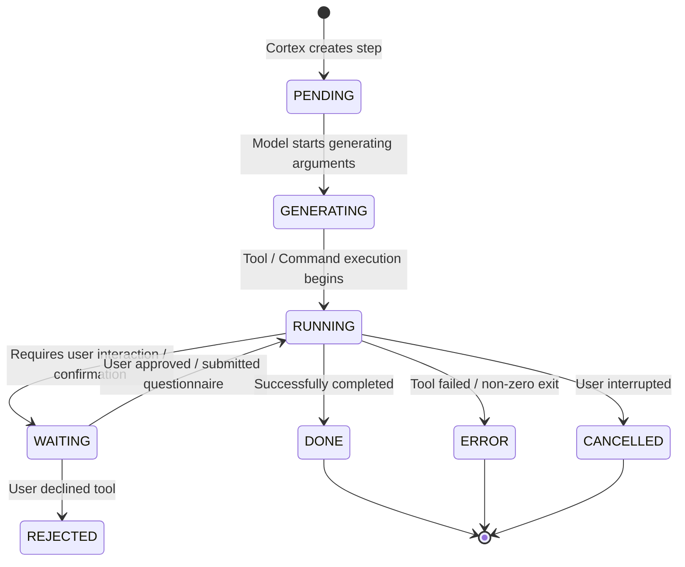

# `StreamAgentStateUpdates` (Live Multi-Frame Chat Streaming RPC)

## 1. Overview & Purpose
`StreamAgentStateUpdates` is the primary streaming RPC in AGY Hub. It establishes a persistent, bi-directional gRPC-Web / Connect-RPC server-streaming HTTP/2 connection between the client and AGY Hub daemon to stream:
- **Full Historical Trajectory Sync (Chunk 0)** upon connection.
- **Real-Time Step Transitions & Output Deltas (Chunks 1..N)** for user prompts, model thoughts, tool executions, terminal command streaming, and interactive questionnaires.
- **Cascade Lifecycle Transitions** (`CASCADE_RUN_STATUS_RUNNING`, `CASCADE_RUN_STATUS_WAITING_USER_INPUT`, `CASCADE_RUN_STATUS_IDLE`, `CASCADE_RUN_STATUS_ERROR`).

---

## 2. Wire Protocol & Endpoint Specification

- **Service Path:** `/exa.language_server_pb.LanguageServerService/StreamAgentStateUpdates`
- **HTTP Method:** `POST`
- **Transport Framing:** gRPC-Web binary framing (5-byte frame header: `1 byte Flag` + `4 bytes Big-Endian Length` + `JSON Payload`)
- **Default Port:** `8090` (or `8091` via proxy)

### HTTP Headers
```http
POST /exa.language_server_pb.LanguageServerService/StreamAgentStateUpdates HTTP/1.1
Host: 127.0.0.1:8090
Content-Type: application/grpc-web+proto
Accept: application/grpc-web+proto
Connect-Protocol-Version: 1
x-conversation-id: <CASCADE_UUID>
x-cascade-id: <CASCADE_UUID>
```

---

## 3. Concrete Request Schema

### Request Body (JSON)
```json
{
  "cascadeId": "f114692e-a724-47fd-b3bf-969760907bbf"
}
```

### Kotlin `@Serializable` Request Model
```kotlin
package com.example.gemini.data.remote.dto

import kotlinx.serialization.Serializable

@Serializable
data class StreamAgentStateUpdatesRequestDto(
    val cascadeId: String = ""
)
```

---

## 4. Concrete Response Stream Frame Schemas

### Frame Structure
Each frame over the gRPC-Web stream is decoded as:
- **`DATA (0x00)`**: Frame contains an incremental `AgyStreamStateFrameDto`.
- **`TRAILER (0x80)`**: Stream termination frame containing gRPC status headers (e.g. `grpc-status: 0`).

### Kotlin `@Serializable` Response Models
```kotlin
package com.example.gemini.data.remote.dto

import kotlinx.serialization.Serializable
import kotlinx.serialization.json.JsonElement
import kotlinx.serialization.json.JsonObject

@Serializable
data class AgyStreamStateFrameDto(
    val update: AgyMainUpdateDto? = null,
    val mainTrajectoryUpdate: AgyMainTrajectoryUpdateDto? = null,
    val stepsUpdate: AgyStepsUpdateDto? = null,
    val steps: List<CortexStepDto>? = null,
    val status: String = "",
    val executableStatus: String = ""
)

@Serializable
data class AgyMainUpdateDto(
    val conversationId: String = "",
    val trajectoryId: String = "",
    val status: String = "",
    val executableStatus: String = "",
    val executorLoopStatus: String = "",
    val mainTrajectoryUpdate: AgyMainTrajectoryUpdateDto? = null,
    val stepsUpdate: AgyStepsUpdateDto? = null
)

@Serializable
data class AgyMainTrajectoryUpdateDto(
    val stepsUpdate: AgyStepsUpdateDto? = null,
    val trajectoryId: String = "",
    val generatorMetadatasUpdate: JsonObject? = null
)

@Serializable
data class AgyStepsUpdateDto(
    val indices: List<Int> = emptyList(),
    val steps: List<CortexStepDto> = emptyList(),
    val totalLength: Int = 0,
    val pageBounds: StepPageBoundsDto? = null
)

@Serializable
data class StepPageBoundsDto(
    val startIndex: Int? = null,
    val endIndex: Int? = null
)

@Serializable
data class CortexStepDto(
    val type: String = "",
    val status: String = "",
    val metadata: CortexStepMetadataDto? = null,
    val userInput: CortexUserInputDto? = null,
    val plannerResponse: CortexPlannerResponseDto? = null,
    val generic: AgyGenericStepDto? = null,
    val requestedInteraction: AgyRequestedInteractionDto? = null,
    val systemMessage: CortexSystemMessageDto? = null,
    val taskDetails: CortexTaskDetailsDto? = null,
    val completedInteractions: List<JsonElement> = emptyList(),
    val permissions: JsonElement? = null,
    val error: CortexErrorDto? = null
)

@Serializable
data class CortexStepMetadataDto(
    val createdAt: String = "",
    val viewableAt: String = "",
    val finishedGeneratingAt: String = "",
    val startedAt: String = "",
    val completedAt: String = "",
    val source: String = "",
    val executionId: String = "",
    val generatorModel: String = "",
    val toolAction: String = "",
    val toolSummary: String = "",
    val toolCall: AgyToolCallMetadataDto? = null,
    val modelUsage: CortexModelUsageDto? = null,
    val sourceTrajectoryStepInfo: SourceTrajectoryStepInfoDto? = null,
    val preToolHookResults: List<PreToolHookResultDto> = emptyList()
)

@Serializable
data class AgyToolCallMetadataDto(
    val id: String = "",
    val name: String = "",
    val thinkingSignature: String = ""
)

@Serializable
data class SourceTrajectoryStepInfoDto(
    val trajectoryId: String = "",
    val cascadeId: String = "",
    val stepIndex: Int = 0,
    val metadataIndex: Int = 0,
    val turnIndex: Int = 0
)

@Serializable
data class CortexModelUsageDto(
    val model: String = "",
    val inputTokens: String = "0",
    val outputTokens: String = "0",
    val thinkingOutputTokens: String = "0",
    val responseOutputTokens: String = "0",
    val apiProvider: String = "",
    val messageId: String = "",
    val responseId: String = ""
)

@Serializable
data class PreToolHookResultDto(
    val decision: String = "allow"
)

@Serializable
data class CortexUserInputDto(
    val items: List<CascadeMessageItemDto> = emptyList(),
    val userResponse: String = "",
    val content: String = "",
    val media: List<MediaAttachmentDto> = emptyList()
)

@Serializable
data class CortexPlannerResponseDto(
    val response: String = "",
    val thinking: String = "",
    val modifiedResponse: String = "",
    val messageId: String = "",
    val stopReason: String = ""
)

@Serializable
data class AgyGenericStepDto(
    val name: String = "",
    val args: JsonObject = JsonObject(emptyMap()),
    val result: AgyGenericResultDto? = null
)

@Serializable
data class AgyGenericResultDto(
    val fullOutputUri: String? = null,
    val payload: JsonObject? = null
)

@Serializable
data class CortexSystemMessageDto(
    val content: String = "",
    val title: String = ""
)

@Serializable
data class CortexTaskDetailsDto(
    val description: String = "",
    val status: String = ""
)

@Serializable
data class CortexErrorDto(
    val message: String = "",
    val code: Int = 0,
    val details: String = ""
)
```

---

## 5. Step Lifecycle & State Transitions

### Step Status Lifecycle


### Wire Enum Values
| Wire Enum String | Description | Mapped UI Status |
| :--- | :--- | :--- |
| `CORTEX_STEP_STATUS_PENDING` | Step queued | `RUNNING` |
| `CORTEX_STEP_STATUS_GENERATING` | Planner streaming thought/args | `RUNNING` |
| `CORTEX_STEP_STATUS_RUNNING` | Tool actively executing in shell | `RUNNING` |
| `CORTEX_STEP_STATUS_WAITING` | Step waiting on user interaction | `PENDING_APPROVAL` / `AWAITING_CHOICE` |
| `CORTEX_STEP_STATUS_DONE` | Step completed successfully | `SUCCESS` |
| `CORTEX_STEP_STATUS_ERROR` | Step encountered an error | `FAILED` |
| `CORTEX_STEP_STATUS_CANCELLED`| Step cancelled by user | `CANCELLED` |

---

## 6. Live Delta Stream Merging Algorithm

When streaming `StreamAgentStateUpdates`:
1. **Frame #1 (Chunk 0 - Initial Sync)**:
   - Contains `indices: [0, 1, ..., N]` and `steps: [...]` representing the complete history.
   - Initialized into the conversation state.
2. **Frames #2..M (Live Deltas)**:
   - Contains a subset of `indices` and `steps`.
   - For each index `idx` in `indices`:
     - If `idx < totalSteps`: Replace/update existing step at position `idx`.
     - If `idx >= totalSteps`: Append new step at position `idx`.
3. **Turn Construction (`ChatBlock`)**:
   - Each step maps cleanly to a `ChatBlock`:
     - `CORTEX_STEP_TYPE_USER_INPUT` $\to$ `ChatMessage(role = USER)`
     - `plannerResponse.thinking` $\to$ `ChatBlock.Thought`
     - `plannerResponse.response` $\to$ `ChatBlock.MarkdownText`
     - `CORTEX_STEP_TYPE_GENERIC` $\to$ `ChatBlock.ToolExecution(ToolCall)`
4. **Ordering Invariant**:
   - Blocks inside an assistant message are ordered **strictly by `stepIndex`**, permanently preventing out-of-order tool cards.

---

## 7. Real Traffic Example (from `session_1_raw.jsonl`)

### Frame #1: Initial History Sync
```json
{
  "update": {
    "conversationId": "8931c764-d295-45c7-b362-c23fcea804cc",
    "trajectoryId": "b715bca6-c251-448a-b21a-e10bb35c0f4f",
    "status": "CASCADE_RUN_STATUS_IDLE",
    "mainTrajectoryUpdate": {
      "stepsUpdate": {
        "indices": [0, 1],
        "steps": [
          {
            "type": "CORTEX_STEP_TYPE_USER_INPUT",
            "status": "CORTEX_STEP_STATUS_DONE",
            "userInput": {
              "items": [{ "text": "Say 1 only" }],
              "userResponse": "Say 1 only"
            }
          },
          {
            "type": "CORTEX_STEP_TYPE_PLANNER_RESPONSE",
            "status": "CORTEX_STEP_STATUS_DONE",
            "plannerResponse": {
              "response": "1"
            }
          }
        ],
        "totalLength": 2
      }
    }
  }
}
```

### Frame #42: Live Incremental Tool Execution Step
```json
{
  "update": {
    "status": "CASCADE_RUN_STATUS_RUNNING",
    "mainTrajectoryUpdate": {
      "stepsUpdate": {
        "indices": [4],
        "steps": [
          {
            "type": "CORTEX_STEP_TYPE_GENERIC",
            "status": "CORTEX_STEP_STATUS_DONE",
            "metadata": {
              "toolCall": {
                "id": "call_758344",
                "name": "run_command"
              },
              "sourceTrajectoryStepInfo": {
                "stepIndex": 4
              }
            },
            "generic": {
              "args": {
                "CommandLine": "echo \"Hello from tool test\"",
                "Cwd": "/home/cat/.gemini/antigravity",
                "toolAction": "Testing command execution"
              },
              "result": {
                "fullOutputUri": "file:///home/cat/.gemini/antigravity/brain/.../output.txt",
                "payload": {
                  "runCommand": {
                    "commandLine": "echo \"Hello from tool test\"",
                    "exitCode": 0,
                    "combinedOutput": {
                      "full": "Hello from tool test\r\n"
                    }
                  }
                }
              }
            }
          }
        ]
      }
    }
  }
}
```
